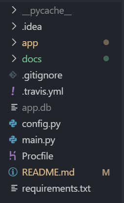

.. Connect 365 documentation master file, created by
   sphinx-quickstart on Fri Dec  6 20:41:13 2019.
   You can adapt this file completely to your liking, but it should at least
   contain the root `toctree` directive.

**Connect 365 Documentation**
=======================================

*******************
Indices and tables
*******************

* :ref:`genindex`
* :ref:`modindex`
* :ref:`search`

*********
Overview:
*********

Many students have trouble aligning their schedule with friends and finding the time to hang out. Determining the availability of your friends is even more difficult with larger groups, as you would have to either view all their schedules individually or message everyone in a group chat (which can be a hassle to do). 

The objective of our web application is to solve scheduling issues among friends, and allow one to easily access a friend’s availability at any given time.

Live Website: https://connect-365.herokuapp.com

****************
Getting Started
****************
To setup a localhost web server for developmental purposes, install Python 3.6 with pip.
Next, install the required packages in terminal
``pip install -U -r requirements.txt``
To run the application
``python main.py``

************
Test Cases
************
The purpose of unit testing is to validate functionalities of the application when new code is pushed to the repository. TravisCI will determine if the test cases pass or fail.

The test cases are located in the `app` folder.

###################
Running Test Cases
###################
Ensure that `pytest` is installed
``pip install pytest``
To run all the test cases of this application, go to the project's base directory and type the following in terminal
``pytest``
Test cases are successful if there are no errors (indicated in green)

**********
Features
**********
- **Log-in**: Users will input their information and log into their account.
- **Log-out**: Once finished using the website, users will be able to log out from their account.
- **Register**: If the user does not have an account they will be able to register with a new account.
- **Create Event**: When the user is logged in, they can create events or plans for the upcoming week/month/year.
- **View Event**: Users will be able to see their events.
- **Delete Event**: Users will be able to delete their events.
- **Set Status**: When logged in, users can set their status as available or unavailable for their friends to see.
- **Add Friend**: Users can add their friends by sending a friend request.
- **Friend Request**: Users will be able to accept or decline incoming friend requests.
- **Set Schedule**: Users will be able to set their schedule by setting which hour of the day in the week they are available.
- **View Friend**: On the home page, users will be able to see their added friends and availability status.
- **View Friend's Schedule**: Users will be able to click on their friends' schedules and view them in a modal.

*************
Built With
*************
- `Python <http://www.python.org/>`_: An interpreted, high-level, general-purpose programming language.
- `Flask <http://flask.palletsprojects.com/en/1.1.x/>`_: A micro web framework written in Python
- `SQLAlchemy <https://www.sqlalchemy.org/>`_: An open-source SQL toolkit and object-relational mapper (ORM) for the Python programming language released under the MIT License
- `JavaScript <https://www.javascript.com/>`_: A lightweight, interpreted, or just-in-time compiled programming language with first-class functions.
- `JQuery <https://jquery.com/>`_: A JavaScript library designed to simplify HTML DOM tree traversal and manipulation, as well as event handling, CSS animation, and Ajax.
- `HTML <https://developer.mozilla.org/en-US/docs/Web/HTML>`_, `CSS <https://developer.mozilla.org/en-US/docs/Web/CSS>`_: Hypertext Markup Language and Cascading Style Sheet
- `Bootstrap <https://getbootstrap.com/>`_: An open-source CSS framework directed at responsive, mobile-first front-end web development.
- `Heroku <https://www.heroku.com/>`_: A cloud platform used to deploy, manage, and scale modern apps.

***********************
Connect 365 Navigation
***********************
Image of the application's root folder.

- **main.py** - Main file that runs our application.
- **config.py** - Config file that contains information for our database.
- **requirements.txt** - List of required libraries needed to run our application.
- **app folder** - Directory that contains the application's main code.
- **docs folder** - Folder that contains files & documentation via Sphinx.

Image of the application's app folder.

.. image:: images/appLevel.png

- **__init__.py** - Initializes the application.
- **forms.py** - Contains flask_wtf forms used in templates. 
- **models.py** - Contains models of our database tables.
- **routes.py** - Sets valid routes and the code executed when visiting that route.
- **test_main.py** - Test file that is executed via pytest.
- **static folder** - Contains CSS, BootStrap and images.
- **templates folder** - Contains HTML files using Jinja's templating style.

.. toctree::
   :maxdepth: 2